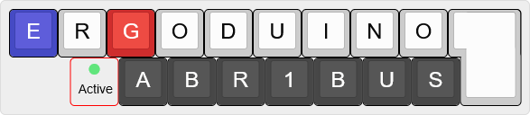

# Introducing

- 👋 Hi, I’m @Abr1bus

- 👀 I’m interested in ... everything !

- 📅 My current project : building a mechanical keyboard. I called it ErgoDuino, like ErgoDox with Arduino :innocent:

----

# My projects

Link to the my main project : [Ergoduino](https://github.com/Abr1bus/ErgoDuino) ( :construction: It's now in construction, I am working hard to design the PCB :construction: )
